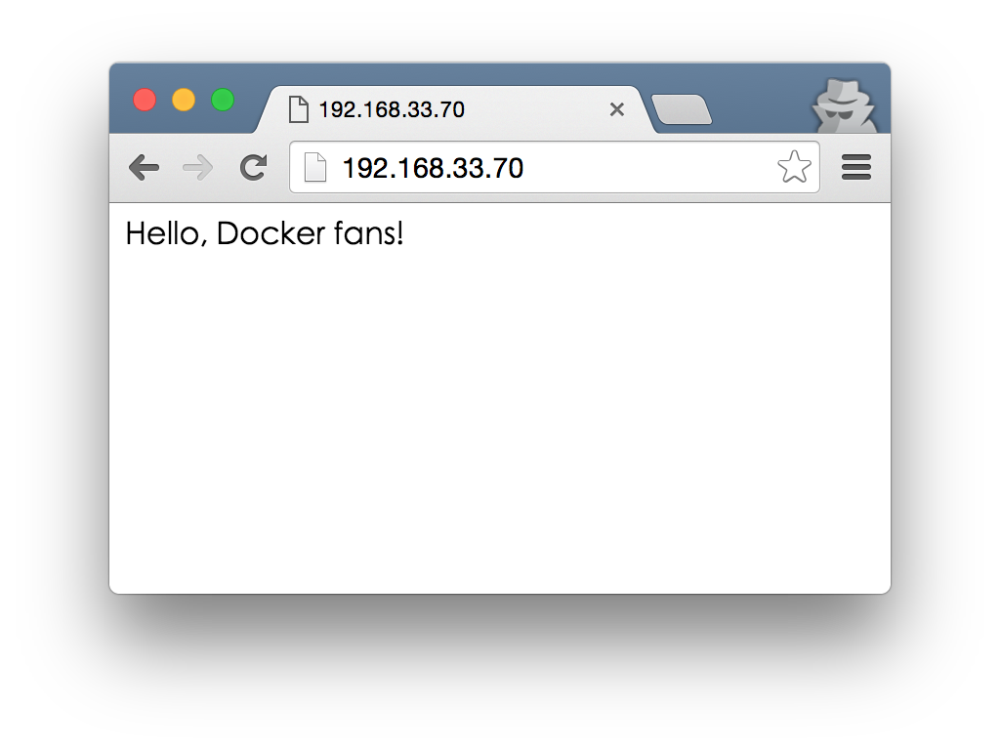

# Docker 從頭開始

這是一邊閱讀[Getting Started with Docker](https://serversforhackers.com/getting-started-with-docker)一邊練習的筆記。完整說明建議參考原出處。


實驗環境
- Host OS: OS X 10.10.5
- Guest OS: ubuntu/trusty64 on VirtualBox/Vagrant

實驗目標
- 是在guest os內製作一個執行nginx web server的docker container，最後能在host os透過瀏覽器連接web server

## Vagrantfile

修改```Vagrantfile```，設定guest os對外的網路。
```
config.vm.box = "ubuntu/trusty64"
config.vm.network "private_network", ip: "192.168.33.70"
```

設定好後，使用vagrant指令啟動虛擬機
```
$ vagrant up
```

虛擬機啟動後，透過ssh連線登入，確定private_network interface設定成功
```
$ vagrant ssh
Welcome to Ubuntu 14.04.3 LTS (GNU/Linux 3.13.0-66-generic x86_64)

 * Documentation:  https://help.ubuntu.com/

  System information as of Sun Jan 10 03:27:44 UTC 2016

  System load:  0.39              Users logged in:        0
  Usage of /:   4.9% of 39.34GB   IP address for eth0:    10.0.2.15
  Memory usage: 28%               IP address for eth1:    192.168.33.70
  Swap usage:   0%                IP address for docker0: 172.17.42.1
  ...
```

登入guest os後切換```root```使用者身份
```
$ sudo su -
```

## 第一個 docker container

使用```docker run```啟動一個container。
- 指令：```docker run <Image> [Command]```
```
# docker run ubuntu /bin/bash
# docker ps -a
CONTAINER ID        IMAGE               COMMAND             CREATED             STATUS                     PORTS               NAMES
09997635bafe        ubuntu:latest       "/bin/bash"         3 seconds ago       Exited (0) 2 seconds ago                       loving_heisenberg
```

觀察到container```09997635bafe```狀態是exited。因為container裡面沒有執行的process，所以container處於停止的狀態。

再```run```一次，但這次加上```-t```與```-i```選項 (分配tty並保持stdin開啟)。
```
# docker run -ti ubuntu /bin/bash
root@b6171817af95:/# echo "hello world" > hello.txt
root@b6171817af95:/# exit
```

觀察剛剛在container內的操作，對原先images做了什麼改變。
- 指令：```docker diff <Container ID>```
```
# docker diff b6171817af95
C /root
A /root/.bash_history
A /hello.txt
```

## 追蹤修改

docker 會追蹤任何對container造成的改變。docker 允許改變 images 內容，提交這些改變，然後push這些改變到其他地方。這就是用docker進行部署的基礎。

再一次，我們執行一個container，並用安裝一些套件。
```
# docker run -ti ubuntu /bin/bash
root@054f7b9e9f77:/# apt-get update
root@054f7b9e9f77:/# apt-get install -y git ack-grep vim curl wget tmux build-essential python-software-properties
root@054f7b9e9f77:/# exit
```

再使用```docker diff```會看到一堆安裝過的東西。
- 指令：```docker commit <Container ID> <Name>:<Tag>```
```
# docker commit 054f7b9e9f77 fideloper/docker-example:0.1
```

下一步，把剛剛做的修改打包成一個 image，以便將來使用。
- 指令：```docker commit <Container ID> <Name>:<Tag>```
```
# docker commit 054f7b9e9f77 fideloper/docker-example:0.1
30059fbd9d2a0a4f2c74f895757f96479bc3d66030b1990269d163f830dd674b
```

看看目前保存的image ID是否包含```30059fbd9d2a0a4f2c74f895757f96479bc3d66030b1990269d163f830dd674b```
- 指令：```docker images```
```
# docker images
REPOSITORY                 TAG                 IMAGE ID            CREATED             VIRTUAL SIZE
fideloper/docker-example   0.1                 30059fbd9d2a        5 minutes ago       429.1 MB
ubuntu                     latest              d55e68e6cc9c        4 weeks ago         187.9 MB
```

找到一個Image，id=```30059fbd9d2a```，repository=```fideloper/docker-example```，這就是剛剛打包的image。

## 使用 Dockerfile 建立 server

先創建一個目錄，然後進到裡面
```
# mkdir build
# cd build
```

產生一個```default```的檔案 (Nginx 的設定檔)
```
server {
    root /var/www;
    index index.html index.htm;

    # Make site accessible from http://localhost/
    server_name localhost;

    location / {
        # First attempt to serve request as file, then
        # as directory, then fall back to index.html
        try_files $uri $uri/ /index.html;
    }
}
```

產生一個```Dockerfile``` (docker image的設定檔)
```
FROM fideloper/docker-example:0.1

RUN echo "deb http://archive.ubuntu.com/ubuntu precise main universe" > /etc/apt/sources.list
RUN apt-get update
RUN apt-get -y install nginx

RUN echo "daemon off;" >> /etc/nginx/nginx.conf
RUN mkdir /etc/nginx/ssl
ADD default /etc/nginx/sites-available/default

EXPOSE 80

CMD ["nginx"]
```
- FROM：根據那個base image
- RUN：創建過程要執行哪些指令
- ADD：創建過程要加入哪些檔案
- EXPOSE：要讓host os看見哪些port
- RUN：docker container啟動後，執行的指令

透過```Dockerfile```建立一個新的image
```
# docker build -t nginx-example .
Successfully built dfe974949c9e
```

觀察新增哪些image，找到剛剛製作的image```nginx-example```。
```
# docker images
REPOSITORY                 TAG                 IMAGE ID            CREATED             VIRTUAL SIZE
nginx-example              latest              dfe974949c9e        3 minutes ago       450.1 MB
fideloper/docker-example   0.1                 30059fbd9d2a        26 minutes ago      429.1 MB
ubuntu                     latest              d55e68e6cc9c        4 weeks ago         187.9 MB
```

再次觀察container執行狀態，看到一些之前使用```docker run```產生的container。使用```docker rm```將那些已經停止運行的container移除。
- 指令：```docker rm CONTAINER [CONTAINER...]```
```
# docker ps -a
CONTAINER ID        IMAGE               COMMAND             CREATED             STATUS                      PORTS               NAMES
054f7b9e9f77        ubuntu:latest       "/bin/bash"         40 minutes ago      Exited (0) 34 minutes ago                       trusting_payne
b6171817af95        ubuntu:latest       "/bin/bash"         50 minutes ago      Exited (0) 49 minutes ago                       naughty_hypatia
09997635bafe        ubuntu:latest       "/bin/bash"         About an hour ago   Exited (0) 59 minutes ago                       loving_heisenberg
# docker rm $(docker ps -aq)
054f7b9e9f77
b6171817af95
09997635bafe
```

## 起來吧！Web server

使用```docker run -p 80:80```啟動 web server 並把 container 80 port 對應到 host os 的 80 port。
```
# docker run -p 80:80 -d nginx-example
b5b1f7ec08d0ee972fcb58939541a1e5039d4d43fe4f93f7cddba98fa1d54940
# docker ps
CONTAINER ID        IMAGE                  COMMAND             CREATED             STATUS              PORTS                NAMES
b5b1f7ec08d0        nginx-example:latest   "nginx"             3 seconds ago       Up 3 seconds        0.0.0.0:80->80/tcp   goofy_perlman
```

使用 curl 連接 web server，發生錯誤的原因是因為沒有給```index.html```
```
# curl localhost:80
<html>
<head><title>500 Internal Server Error</title></head>
<body bgcolor="white">
<center><h1>500 Internal Server Error</h1></center>
<hr><center>nginx/1.1.19</center>
</body>
</html>
```

停止container，弄一個簡單的目錄，放一個```index.html```，再來一次。
```
# docker stop b5b1f7ec08d0
b5b1f7ec08d0
# mkdir share
# echo "Hello, Docker fans!" >> share/index.html
# docker run -v /root/build/share/:/var/www -p 80:80 -d nginx-example
a90c01b21d6306166e8aa1b4cc7b511aa68e6ed45df45e1c50c609854ea1d34b
```
- ```-v /host:/container```：指定 container 與 host 共享目錄
- ```-p 80:80```：將host 80 port綁定到container 80 port
- ```-d nginx-example```：執行image dockerfile裡面```CMD```的動作 - 執行nginx web server

使用 curl 連接 web server，看到我們想要的結果了 :D
```
# curl localhost:80
Hello, Docker fans!
```

或是在host os上使用瀏覽器，開啟網址```192.168.33.70```也可看到類似結果
- docker:80 -> ubuntu:80 -> virbualbox 192.168.33.70:80


